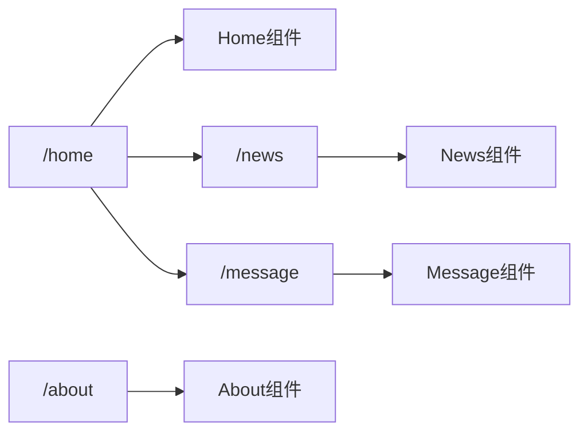

#  nvue
code recorded in the process of learning vue

## 1-vue初体验

程序位置:E:\Vue\LearnVuejs01\01-Vue初体验\01-HelloVuejs.html

+ 代码创建了一个Vue对象
+ 创建Vue对象的时候，传入了一些options:{}
  - {}中包含了el属性：该属性决定了这个Vue对象挂载到哪一个元素上
  - {}中包含了data属性，改属性中通常会存储一些数据
    * 这些数据可以是我们直接定义出来的。
    * 也可能是来自网络，服务器加载的。
+ 浏览器执行代码的流程：
  - 执行HTML
  - 创建Vue实例后，对原HTML内容进行解析和修改

## 2-vue中的mvvm

### 2.1 mvvm定义

MVVM(Model-view-viewmodel)是一种软件架构模式，MVVM有助于将图形用户界面的开发与业务逻辑或后端逻辑(数据模型)的开发分离开来。

### 2.2 mvvm模式的组成部分


#### 2.2.1 Model

模型是指代表真实状态内容的领域模型(面向对象)，或指代表内容的数据访问层(以数据为中心)

#### 2.2.2 视图

视图是用户在屏幕上看到的结构，布局和外观（UI）

#### 2.2.3 视图模型

视图模型是暴露公共属性和命令的视图的抽象 。

#### 2.2.4 绑定器

声明性数据和命令绑定隐含在MVVM模式中。

## 3-创建vue实例传入的options

### 3.1 options

- el：
  - 类型：string|HTMLElement
  - 作用：决定之后VUE实例会管理哪一个DOM

- data:
  - 类型：Object|Function（组件当中data必须是一个函数）
  - 作用：Vue实例对应的数据对象

- methods:

  - 类型：{{key:string}:Function}
  - 作用：定义属于Vue的一些方法，可以在其他地方调用，也可以在指令中调用

## 4-vue的生命周期

#### 4. 1 生命周期图示


## 5-vue基础语法

### 5.1 v-once

* 该指令后面不要跟任何表达式(比如之前的v-for后面是跟表达式的)
* 该指令表示元素和组件（组件后面才会学习）只渲染一次，不会随着数据的改变而改变

### 5.2 v-html

某些情况下，我们从服务器请求到的数据本身就是一个HTML代码

* 如果直接通过{{}}来输出，会将HTML代码一起输出
* 因此需要对HTML格式进行解析，并且显示出对应的内容

对HTML格式内容的解析

* 可以使用v-html指令
  * 该指令后面往往会跟上一个string类型
  * 会将string的html解析出来并且进行渲染

### 5.3 v-text

* v-text作用和Mustache比较相似：都是用于将数据显示在界面中
* v-text通常情况下，接受一个string类型

### 5.4 v-pre

* v-pre用于跳过这个元素和它子元素的编译过程，用于显示原本的Mustache语法

### 5.5 v-cloak

* 在某些情况下，浏览器可能会直接显示出未编译的Mustache标签

## 6-v-bind

除了内容需要动态来决定之外，某些属性也希望动态来绑定，比如：

* 动态绑定a元素的hred属性
* 动态绑定img元素的src属性

这个时候需要使用v-bind指令：

* 作用：动态绑定属性
* 缩写/语法糖：:
* 预期：any(with argument) | Object (without argument)
* 参数：attrOrProp(optional)

### 6.1 v-bind绑定class

绑定class有两种方法

* 对象语法
* 数组语法

对象语法有以下这些用法：

* 用法一：直接通过{}绑定一个类

  ```html
  <h2 :class={'active':isActive} >Hello World</h2>
  ```

* 用法二：也可以通过判断，传入多个值

  ```html
  <h2 :class={'active':isActive, isLine: isLine} >Hello World</h2>
  ```

* 用法三：和普通的类同时存在，并不冲突

  ```vue
  <h2 class="Title" :class={'active':isActive, isLine: isLine} >Hello World</h2>
  ```

* 用法四：如果过于复杂，可以放在一个methods或者computed中

### 6.2 v-bind绑定style

* 绑定方式一：对象语法

  ```html
  :style="{fontSize: finalSize + 'px', color: finalColor}"
  ```

  style后面跟的是一个对象类型

  * 对象的key是CSS属性名称
  * 对象的value是具体赋的值，值可以来自于data中的属性

* 绑定方式二：数组语法

  ```html
  <div v-bind:style:="[baseStyles, overridingStyles]"></div>
  ```

  * style后面跟的是一个数组类型
    * 多个值以，分割

## 7-计算属性

* 在模板中可以直接通过插值语法显示一些data中的数据
* 在某些情况下，我们可能需要对数据进行一些转化后再显示，或者需要将多个数据结合起来进行显示
  * 比如我们有firstName和lastName两个变量，我们需要完整的名称
  * 但是如果多个地方都需要显示完整的名称，我们就需要写多个{{firstName}} {{lastName}}

* 可以将上面的代码换成计算属性：
  * 计算属性是写在实例的computed选项中的。

### 7.1 计算属性的setter和getter

* 每个计算属性都包含一个getter和一个setter

### 7.2 计算属性的缓存

>  methods和computed看起来都可以实现我们的功能，那么为什么还要多一个计算属性呢？

原因：计算属性会进行缓存，如果多次使用，计算属性只会调用一次

## 8-let/var

事实上var的设计可以看成JavaScript语言设计上的错误。但是这种错误多半不能修复和移除，因为需要向后兼容。

* 大概十年前，Brendan Eich就决定修复这个问题，于是他添加了一个新的关键字：let
* 可以将let看成更完美的var

### 8.1 块级作用域

* JS中使用var来声明一个变量时，变量的作用域主要是和函数的定义有关
* 针对于其他块定义来说是没有区块域的，比如if/for等，在开发中往往会引起一些问题

## 9-v-on

### 9.1 v-on介绍

* 作用：绑定事件监听
* 缩写：@
* 预期：Function|Inline Statement|Object
* 参数：event

### 9.2 v-on参数

当通过methods中定义方法，以供@click调用时，需要注意参数问题：

* 情况一：如果该方法不需要额外参数，那么方法后的()可以不添加
* 情况二：如果需要同时传入某个参数，并且需要event时，可以通过$event传入事件

### 9.3 v-on修饰符

在某些情况下，我们拿到event的目的可能是进行一些事件处理  

vue提供了修饰符来帮助我们方便的处理一些事件：

* .stop - 调用event.stopPropagation()
* .prevent- 调用event.preventDefault()
* .{keyCode|keyAlias}-只当事件是从特定键触发时才触发回调
* .native-监听组件根元素的原生事件
* .once-只触发一次回调

## 10-案例小问题


小问题：

* 在有输入内容的情况下，切换了类型，会发现文字依然显示之前的输入的内容
* 但是，实质上我们应该切换到另外一个input元素中
* 在另外一个input元素中，并没有输入内容
* 为什么会出现这个问题呢？

问题解答：

* 这是因为vue在进行DOM渲染时，出于性能考虑会尽可能的复用之前已经存在的 元素，而不是重新创建新的元素
* 在上面的案例中，vue内部会发现原来的input元素不再使用，直接作为else的input来使用了

解决方案：

* 如果不希望vue出现类似重复作用的问题，可以给对应的input添加key
* 并且需要保证key的不同

## 11-v-show

* v-show的用法和v-if用法非常相似，也用于决定一个元素是否渲染

### 11.1 v-show和v-if对比

* v-if当条件为false时，压根不会有对应的元素在DOM中
* v-show当条件为false时，仅仅是将 元素的display属性设置为none而已。

### 11.2 开发中的选择

* 当需要在显示与隐藏之间切片很频繁时，使用v-show
* 当只有一次切换时，通过使用v-if

## 12-v-for

### 12.1 v-for遍历数组

* 当有一组数据需要进行渲染时，可以使用v-for来完成
  * v-for的语法类似于JavaScrip中的for循环
  * 格式如下：item in items的形式

#### 12.1.1 简单案例

* 在遍历中不需要索引值
  * v-for="movie in movies"
  * 依次从movies中取出movie，并且在元素中的内容中，可以使用Mustache语法，来使用movie

* 在遍历中需要拿到元素在数组中的索引值
  * 语法格式：v-for=(item, index) in items
  * 其中的index就代表了取出的item在原数组中的索引值

### 12.2 v-for遍历对象

* v-for可以遍历对象
  * 格式如下：v-for="(value, key, index) in info"

### 12.3 组件的key属性

vue官方推荐在使用v-for时，给对应的元素或组件添加：key属性

#### 12.3.1 使用key属性的原因

* 与Vue的虚拟DOM的Diff算法有关系
* React's diff algorithm


* 当某一层又很多相同的节点时，也就是列表节点，我们希望插入一个新的节点：

  * 希望在B和C之间加一个F，Diff算法默认执行：把C更新成F，D更新成C，E更新成D，最后再插入E

* 因此 需要使用key来给每一个节点做一个唯一标识

  * Diff算法就可以正确的识别此节点
  * 找到正确的位置区插入新的节点

* 总的来说就是key可以高效的更新虚拟DOM

  

## 13-表单绑定v-model

表单控件在实际开发中是非常非常常见的，特别是对于用户信息的提交，需要大量的表单。

Vue中使用v-model指令来实现表单元素和数据的双向绑定

### 13.1 案例解析


* 因为input中的v-model绑定了message，所以会实时将输入的内容message，message发生改变
* 当message发生改变时，使用了Mustache语法，将message的值插入到DOM中，所以DOM会发生响应的改变
* 所以通过v-model实现了双向的绑定

v-model也可以将v-model用于textarea元素

### 13.2 v-model原理

v-model实际上是一个语法糖，它的背后本质上包含两个操作：

* v-bind绑定一个属性
* v-on指令给当前的元素绑定input事件

下面的两条代码实质上是等同的:

```html
<input type="text" v-model="message">

<input type="text" v-bind:value="message" v-on:input="message= $event.target.value">
```

### 13.3 v-model结合radio类型

示例：


### 13.4  v-model结合checkbox类型

复选框分为两种情况：单个勾选框和多个勾选框

#### 13.4.1 单选框

* v-model即为布尔值

* 此时input的value并不影响v-model的值

* 单选框示例：

  

#### 13.4.2 多选框

* 当是多个复选框时，因为可以选中多个，所以对应的data中属性是一个数组
* 当选中某一个时，就会将input的value添加到数组中

* 多选框示例：


### 13.5 v-model结合select使用

select分为两种情况：单选和多选两种情况

#### 13.5.1 单选

* v-model绑定的是一个值

* 当我们选中option中的一个时，会将它对应的value赋值到对应的data数据中

* 单选示例：

  

  

#### 13.5.2 多选

* v-model绑定的是一个数组

* 当选中多个值时，就会将选中的option对应的value添加到对应的data数据中

* 多选示例：

  

### 13.6 v-model修饰符

#### 13.6.1 lazy修饰符

* 默认情况下, v-model默认是在input事件中同步输入框的数据
* 也就是说，一旦有数据发生改变对应的data中的数据就会自动发生改变
* lazy修饰符可以让数据在失去焦点或者回车时才会更新

#### 13.6.2 number修饰符

* 默认情况下，在输入框中无论我们输入的时字母还是数字，都会被当作是字符串类型进行处理
* 但是如果我们希望处理的是数字类型，那么最好直接将内容当作数字处理
* number修饰符可以让在输入框中输入的内容自动转换成数字类型

#### 13.6.3 trim修饰符

* 如果输入的内容首尾有很多空格，通常我们希望将其去除
* trim修饰符可以将过滤内容左右两边的空格

## 14-vue组件化思想

组件化是Vue.js中的重要思想

* 它提供了一种抽象，让我们可以开发出一个个独立可复用的小组来构造我们的应用
* 任何的应用都会被抽象成一颗组件树


### 14.1 组件化思想的应用

*  尽可能的将页面拆分成一个个小的，可复用的组件
*  这样让我们的代码更加方便组织和管理，复用性也更强

### 14.2 注册组件的基本步骤

组件的使用分成三个步骤：

1. 创建组件构造器
2. 注册组件
3. 使用组件


  

### 14.3 注册组件步骤解析

* Vue.extend():
  * 调用Vue.extend()创建的是一个组件构造器
  * 通常在创建组件构造器时，传入template代表我们自定义组件的模板
  * 该模板就是在使用到组件的地方，要显示的HTML代码
  * 事实上，这种写法在Vue2.x中的文档几乎已经看不到了，它会直接用到语法糖

* Vue.component()
  * 调用Vue.component()是将刚才的组件构造器注册为一个组件，并且给它起一个组件的标签名称
  * 所以需要传递两个参数：1、注册组件的标签名 2、组件构造器

* 组件必须挂载在某个Vue实例下，否则不会生效

### 14.4 全局组件和局部

* 当通过Vue.component()注册组件时，组件的注册是全局的

  * 意味着改组件可以在任意Vue实例下使用

    ```javascript
    const myComponent = Vue.extend({
      // ... 选项 ...  
    })
    
    Vue.component('my-component-name', myComponent)
    
    new Vue({ el: '#app' })
    ```

* 如果注册的组件时挂载在某个实例中，那么就是一个局部组件

  * 组件只能在特定实例下使用

    ```javascript
    var ComponentA = Vue.extend({ /* ... */ })
    var ComponentB = Vue.extend({ /* ... */ })
    var ComponentC = Vue.extend({ /* ... */ })}
    
    Vue.component('component-a', ComponentA)
    Vue.component('component-b', ComponentB)
    Vue.component('component-c', ComponentC)
    
    new Vue({
      el: '#app',
      components: {
        'component-a': ComponentA,
        'component-b': ComponentB
      }
    })
    ```

### 14.5 父组件和子组件

* 组件树：
  * 组件和组件存在层级关系
  * 而其中一种非常重要的关系就是父子组件的关系

* 父子组件错误用法：以子标签的形式在Vue实例中使用
  * 因为当子组件注册到父组件的components时，Vue会编译好父组件的模块
  * 该模板的内容已经决定了父组件将要渲染的HTML（相当于父组件中已经有了子组件的内容）

### 14.6 注册组件的语法糖

在上面注册组件的方式，可能会有些繁琐

* Vue为了简化这个过程，提供了注册的语法糖

* 主要是省去了调用Vue.extend()的步骤，而是可以直接用一个对象来代替

* 语法糖注册全局组件：

  ```javascript
  Vue.component('my-component-name', {
    // ... 选项 ...
  })
  new Vue({ el: '#app' })
  ```

* 语法糖注册局部组件

  ```
  var ComponentA = { /* ... */ }
  var ComponentB = { /* ... */ }
  var ComponentC = { /* ... */ }
  
  new Vue({
    el: '#app',
    components: {
      'component-a': ComponentA,
      'component-b': ComponentB
    }
  })
  ```

### 14.6 注册组件的语法糖

Vue提供了两种方案来定义HTML模块内容：

* 使用<script>标签：

  ```html
  <script type="text/x-template" id="cpn">
  	// ... 内容 ... 
  </script>
  ```

* 使用<template>标签

  ```html
  <template id="cpn">
  	// ... 内容 ...
  </template>
  ```

### 14.8 组件中的data必须是函数

#### 14.8.1 组件不能访问Vue实例数据

* 组件是一个单独功能模块的封装：
  * 这个模块有属于自己的HTML模板，也应该有属于自己的data

* 即使是可以访问，如果所有的数据都放在Vue实例中，Vue实例就会变的非常臃肿
  * Vue组件应该有自己保存数据的地方

#### 14.8.2 组件数据的存放

* 组件对象也有一个data属性(也可以有methods等属性)
* 这个data属性必须是一个函数
* 而且这个函数返回一个对象，对象内部保存着数据

### 14.9 父子组件的通信

开发中，一些数据需要从上层传递到下层：比如在一个页面中，从服务器请求到了很多的数据，其中一部分数据并非是由整个页面的大型组件来展示，而是需要下面的小组件进行展示。这时候，并不会让子组件再次发送一个网络请求，而是直接让**大组件（父组件）**将数据传递给**小组件（子组件）**

#### 14.9.1父子组件的通信方式

* 父组件通过props向子组件传递数据
* 子组件通过事件向父组件发送消息


#### 14.9.2 props数据验证

props选项可以使用数组，但是需要对props进行类型等验证时，可以使用对象写法

验证支持的数据类型：

* String
* Number
* Boolean
* Array
* Object
* Data
* Function
* Symbol

代码示例：

```javascript
Vue.component('my-component', {
  props:{
    // 基础的类型检查('null' 匹配任何类型)
    propA:Number,
    // 多个可能的类型
    propB：[String, Number],
    // 必填的字符串
    propC:{
      type:String,
      required:true,
	},
    // 带有默认值的数字
    propD:{
      type:Number,
      default: 100
    },
    // 带有默认值的对象
    propE:{
      type:Object,
      // 对象或数组默认值必须从一个工厂函数获取
      default(){
          return {message:'hello'}
      }
    },
    propF:{
      validator:function(value){
        // 这个值必须匹配下列字符串中的一个
        retrun ['success', 'warnning', 'danger'].index(value) !==-1
      }
    }
  }
})
```

当有自定义构造函数时，验证也支持自定义的类型

```javascript
function Person(firtname, lastname){
  this.firstname = firstname
  this.lastname = lastname
}

Vue.component('blog-post', {
  props:{
    author: Person
  }
})
```

#### 14.9.3 子组件向父组件传递

props用于父组件向子组件传递数据，还有一种比较常见的是子组件传递数据或事件到父组件中

子组件向父组件的通信需要使用**自定义事件**来完成

* v-on不仅仅可以监听DOM事件，也可以用于组件间的自定义事件

自定义事件的流程：

* 在子组件中，通过$emit()来触发事件
* 在父组件中，通过v-on来监听子组件事件

### 14.10 父子组件的访问方式

有时候需要父组件直接访问子组件，子组件直接访问父组件，或者是子组件访问根组件

#### 14.10.1 父组件访问子组件

父组件访问子组件时，使用\$chidren或\$refs 

* \$chidren：是一个数组类型，它包含所有子组件对象(基本不用)

\$chidren的缺陷：

* 通过\$children访问子组件时，是一个数组类型，访问其中的子组件必须通过索引值
* 当子组件过多时，往往不能确定索引值，索引值甚至可能发生变化
* 当需要明确获取其中一个特定的组件时，这个时候可以用\$refs

\$refs的使用：

* \$refs和ref指令通常是一起使用的
* 首先，通过ref给某一个组件绑定一个特定的ID
* 其次，通过this.$refs.ID就可以访问到该组件

## 15-插槽（slot）

### 15.1 组件的插槽

* 组件的插槽也是为了让我们封装的组件更加具有扩展性
* 让使用者可以决定组件内部的一些内容到底展示什么

### 15.2 封装组件插槽

* 最好的封装方式是将共性抽取到组件中，将不同暴露为插槽
* 一旦预留了插槽，就可以让使用者根据自己的需求，决定插槽中插入什么内容

### 15.3 slot基本使用

* 在子组件中，使用特殊元素`<slot>`就可以为子组件开启一个插槽
* 该插槽插入什么内容取决于父组件如何使用

### 15.4 具名插槽slot

 当子组件的功能复杂时，子组件的插槽可能并非是一个

具名插槽的使用：

* 给slot元素一个name属性
* `<slot name="myslot"></slot>`

### 15.5 编译作用域

***父组件模板的所有东西都会在父级作用域内编译；子组件模板的所有东西都会在子级作用域内编译***

#### 15.5.1 作用域插槽

***父组件替换插槽的标签，但是内容由子组件提供***


## 16-模块化思想

### 16.1 使用模块作为出口

可以将需要暴露到外面的变量，使用一个模块作为出口

```javascript
var MoudleA = (function(){
  // 1.定义一个对象
  var obj = {}
  // 2.在对象内部添加变量和方法
  obj.flag = true
  obj.myFunc = function(info){
    console.log(info)
  }
  // 3. 将对象返回
  return obj
})
```

```javascript
if (MoudleA.flag){
  console.log('moudleA')
}

MoudleA.mysFunc('moudleA')
```

代码解析：

* 在匿名函数内部，定义一个对象
* 给对象添加各种需要暴露到外面的属性和方法
* 最后将对象返回，并且在外面使用一个MoudleA接收

这是模块最基础的封装，事实上模块的封装还有很多高级话题：前端模块化开发已经有了很多既有的规范，以及对应的实现方案

常见的模块化规范：

* CommonJS，AMD, CMD, 也有ES6的Modules

#### 16.1.1 CommonJS

CommonJS的导出：

```javascript
moudle.exports = {
   flag = true,
    test(a,b){
      return a+b
    },
    demo(a,b){
      return a+b
    }
}
```

CommonJS的导入：

```javascript
// CommonJS模块
let {test, demo, flag} = require('moudleA')

//等同于
let _mA = require('moudleA')
let test = _mA.test
let demo = _mA.demo
let flag = _mA.flag
```

### 16.2 ES6模块化的实现

#### 16.2.1 export基本使用

* 导出变量

  写法一：

  ```javascript
  // info.js
  export let name = 'wly'
  export let age = 18
  export height = 1.88
  ```

  写法二：

  ```javascript
  // info.js
  let name = 'wly'
  let age = 18
  let height = 1.88
  
  export{name, age, height}
  ```

* 导出函数或类

  ```javascript
  export function test(content){
  	console.log(content)
  }
  
  export class Person {
  	constructor(name, age){
  		this.name = name;
  		this.age = age;
  	}
  	
  	run(){
  		console.log(this.name + 'running')
  	}
  }
  ```

  ```javascript
  function test(content){
  	console.log(content)
  }
  
  class Person {
  	constructor(name, age){
          this.name = name
          this.age = age
      }
      run(){
          console.log(this.name+'running')
      }
  }
  
  export {test, Person}
  ```

* **export default**

  某些情况下，一个模块中包含某个的功能，我们并不希望给这个功能命名，而且让导入者可以自己来命名，这时候就可以使用export default

  ```javascript
  // info.js
  export default function(){
  	console.log('default function')
  }
  ```

  ```
  import myFunc from './info.js'
  
  myFunc()
  ```

  另外要**注意**：

  * export default在同一个模块中，不允许同时存在多个

#### 16.2.2 import使用

当我们使用export指令导出了模块对外提供的接口，就可以通过import命令来加载对应的模块

* 首先，在HTML代码中引入两个js文件，并且类型需要设置为**module**

  ```html
  <script src="info.js" type="module"></script>
  <script src="main.js" type="module"></script>
  ```

* import指令用于导入模块中的内容，比如main.js代码

  ```javascript
  import {name, age, height} from './info.js'
  
  console.log(name, age, height)
  ```

* 如果希望某个模块中所有信息都导入，一个个导入显然有些麻烦：

  * 通过*可以导入模块中所有的export变量
  * 通常情况下需要给*起一个别名，方便后续的使用

  ```
  import * as info from './info.js'
  
  console.log(info.name, info.age, info.height, info.firends)
  ```

## 17-Webpack

### 17.1 什么是Webpack

官方的解释：

* As its core, webpack is a static module bundler for modern JavaScript applications
* 从本质上来讲，webpack是一个现代的JavaScript应用的静态**模块打包**工具

### 17.2 前端模块化

​	在ES6之前，要想进行模块化的开发，就必须借助于其他的工具，在通过模块化开发完成了项目之后，还需要处

理模块间的各种依赖，并且将其进行整合打包

​	webpack其中一个核心就是进行模块化开发，并且会帮着开发者处理模块间的依赖关系。不仅仅是JavaScript文

件，CSS、图片、json文件等等在webpack中都可以被当作模块来使用的

### 17.3 js文件的打包

在真实项目当中有许多js文件，一个个的引用非常麻烦，并且后期非常不方便对它们进行管理

因此可以使用webpack工具对这些js文件进行打包，webpack是一个模块化的打包工具，所以它支持代码

中写模块化，可以对模块化的代码进行处理，在处理完所有模块之间的关系后，将多个js打包到一个js文

件中引入就会变得非常方便。

 webpack打包指令：

`webpack src/main.js dist/bundle.js`

将生成的bundle.js文件在index.html中引入即可

#### 17.3.1 webpack.config.js配置文件

如果每次使用webpack的命令都需要写上入口和出口作为参数，就非常麻烦，可以将入口和出口都写入`webpack.config.js`配置文件中进行配置

```javascript
const path = require('path')

module.export = {
 	// 入口：可以是字符串/数组/对象
  entry:'./src/main.js',
  // 出口：通常是一个对象，里面至少包含两个重要属性，path和filename
  output:{
    path: path.resolve(__dirname, 'dist'),
    filename: 'bundle.js'
  }
}
```

#### 17.3.2 局部安装webpack

上述所使用的webpack是全局的webpack，通常一个项目都有自己的局部webpack

* 因为一个项目往往依赖特定的webpack版本，全局的版本可能与这个项目的webpack版本不一致，导致打包出现问题

安装指令：

`npm install webpack@3.6.0 --save-dev`

通过node_modules/.bin/webpack启动webpack打包

`node_modules/.bin/webpack`

#### 17.3.4 package.json中定义启动

如果每次打包都要输入上述指令，会将打包程序变得很复杂

因此我们可以在package.json中的scripts的脚本中定义自己的执行脚本，在执行时，会按照一定的顺序寻找命令所对应的位置

* 首先，会寻找本地的node_modules/.bin路径中对应的命令
* 如果没有找到，就会到全局变量中寻找

```json
{
  "name": "meetwebpack",
  "version": "1.0.0",
  "description": "",
  "main": "index.js",
  "scripts": {
    "test": "echo \"Error: no test specified\" && exit 1",
    "build": "webpack"
  },
  "author": "",
  "license": "ISC",
  "devDependencies": {
    "webpack": "^3.6.0"
  }
}
```

在srcipts中，定义了build命令的启动命令，因此我们可以通过build指令执行webpack指令

build指令执行：

`npm run build`

### 17.4 loader

loader是webpack中一个非常核心的概念

webpack的作用:

* webpack可以用来处理js代码，并且webpack会自动js之间相关的依赖
* 但是，在开发中不仅仅有基本的js代码需要处理，也需要加载css、图片、也包括一些高级的将ES6转成ES5代码，将TypeScript转称ES5代码，将scss、less转成css，将.jsx、,vue转成js文件等待
* 对于webpack自身能力来说，对于这些转化是不支持的
* 但是给webpack扩展对应的loader就可以了

loader使用流程：

1.  通过npm安装需要使用的loader
2. 在webpack.config.js中的modules关键字下配置

大部分的loader都可以以在[webpack官网](https://webpack.js.org/)中找到，并学习对应的用法

#### 17.4.1 css-loader-css文件处理

`css-loader`用来处理css文件

安装 `css-loader`:

`npm install --save-dev css-loader`

配置webpack.config.js文件:

```json
const path = require('path')

module.exports = {
    entry: './src/main.js',
    output:{
        path: path.resolve(__dirname, 'dist'),
        filename: 'bundle.js'
    },
    module: {
        rules: [
            {
              test: /\.css$/i,
              // css-loader只负责将css样式加载
              // style-loader负责将样式添加到DOM中
              // 使用多个loader时，从又向左
              use: ["style-loader","css-loader"],
            },
          ],
    }
}
```

**注意**：style-loader需要放在css-loader的前面，因为webpack在读取使用loader的过程中，是按照从右往左的顺序读取的

#### 17.4.2 less-loader-less文件处理

`less-loader`用来处理less文件

安装`less-loader`：

`npm install --save-dev less-loader less`

修改对应的配置文件，添加rules选项，用于处理.less文件

```json
module.exports = {
  module: {
    rules: [
      {
        test: /\.less$/i,
        loader: [
          // compiles Less to CSS
          "style-loader",
          "css-loader",
          "less-loader",
        ],
      },
    ],
  },
};
```

#### 17.4.3 图片文件处理

图片处理，我们可以使用url-loader处理

安装`url-loader`:

`npm install --save-dev url-loader`

修改webpack.config.js配置文件：

```json
{
  test: /\.(png|jpg|gif)$/i,
  use: [
    {
    loader: 'url-loader',
    options: {
    // 当加载的图片小于limit时，会将图片编译成base64字符串的形式，大于时
    // 当加载的图片大于limit时，需要使用file-loader模块进行加载
    limit: 8192
    	},
    },
  ],
},
```

大于8kb的图片，需要通过file-loader来处理

`file-loader`安装：

`npm install --save-dev file-loader`

打包好的图片文件会在dist文件夹中存储，并且图片文件名字非常长：

* 这是一个32位hash值，目的是为了防止名字重复
* 但是在真实开发中，可能对打包的图片名字有一定的要求
* 比如，将所有的图片放在一个文件夹中，跟上图片原来的名称，同时也要防止重复

因此，我们可以在options中添加以下选项：

* img: 文件要打包到的文件夹

* name: 获取图片原来的名字，放在该位置

* hash:8：为了防止图片名称冲突，依然使用hash，但只保留8位

  ```json
  options{
  	limit: 8192,
  	name: 'img/[name].[hash:8].[ext]'
  }
  ```

默认情况下，webpack会将生成的路径直接返回给使用者，但是整个程序又是在dist文件夹下打包的，因此在这里需要在路径下再添加一个dist/路径

```json
output:{
  path: path.resolve(__dirname, 'dist'),
  filename: 'bundle.js',
  publicPath: 'dist/'
},
```

#### 17.4.4 ES6语法处理

babel-loader可以将ES6的语法转成ES5

安装`babel-loader`:

`npm install --save-dev babel-loader@7 babel-core babel-preset-es2015`

配置webpack.config.js文件

```json
{
	test: /\.m?js$/,
	exclude: /(node_modules|bower_components)/,
  use: {
  loader: 'babel-loader',
  options: {
  	presets: ['es2015']
  	}
  }
}
```

重新打包，再次查看打包生成的js文件，发现其中的内容变成了ES5的语法

### 17.5 引入vue.js

 要在项目中引入vue.js，首先需要进行安装：

`npm install vue --save`

引入vue.js:

```javascript
import Vue from 'vue'

new Vue({
	el: '#app',
	data:{
		name: 'wly'
	}
})
```

引入的vue分为两种版本：

1. runtime-only->代码中不可以有任何template
2. Runtime-compiler->代码中，可以有template，因为有compiler可以用于编译template

而引入时默认选择的版本为runtime-only版本，因此修改webpack.config.js文件，配置vue的alias

```json
resolve:{
  alias: {
  	'vue$':'vue/dist/vue.esm.js'
  }
}
```

#### 17.5.1 el和template的区别

在一个项目的开发中，往往不希望频繁的对Index.html进行修改，因此我们可以：

1. 定义el属性，用于和index.html中的#app进行绑定，让Vue实例之后可以管理它其中的内容
2. 在index.html中只保留id为app的元素
3. 在vue实例中定义一个template属性，在template属性定义元素内容

代码如下：

```html
<!DOCTYPE html>
<html>
    <head>
        <meta charset="UTF-8">
        <title></title>
    </head>
    <body>
        <div id='app'></div>
        <script src="./dist/bundle.js"></script>
    </body>
</html>
```

```javascript
new Vue({
    el: '#app',
    template:`
    <div>
        <h2>{{message}}</h2>
        <button @click="btnClick">点击</button>
        <h2>{{name}}</h2>
    </div>
    `,
    data: {
        message: "Hello Webpack",
        name:"wly"
    },
    methods:{
        btnClick(){

        }
    }
})
```

#### 17.5.2 .vue文件封装处理

组件如果以.js对象的形式进行组织和使用的时候是非常不方便的：

* 一方面，编写template模块非常麻烦
* 另一方面，样式的编写也不方便

因此可以使用vue文件来组织一个vue的组件

```vue
<template>
    <div>
        <h2 class="title">{{message}}</h2>
        <button @click="btnClick">点击</button>
        <h2>{{name}}</h2>
        <cpn></cpn>
    </div>
</template>

<script>
import cpn from './Cpn'

export default {
    name: "App",
    data(){
        return {
            message: "Hello Webpack",
            name:"wly"
        }
    },
    methods:{
        btnClick(){

        }
    },
    components:{
        cpn
    }
}
</script>
<style scoped>
    .title {
        color: blanchedalmond;
    }
</style>
```

使用vue文件需要使用vue-loader以及vue-template-complier来帮助文件正确的处理和加载

安装`vue-loader`和`vue-template-complier`

`npm install vue-loader vue-template-complier --save-dev`

 修改webpack.config.js的配置文件：

```json
{
	test: /\.vue$/,
	use:['vue-loader']
}
```

### 17.6 认识plugin

#### 17.6.1 webpack的plugin

* webpack中的插件，就是对webpack现有功能的各种扩展，比如打包优化，文件压缩等

#### 17.6.2 loader和plugin区别

* loader主要是用于转换某些类型的模块，它是一个转换器
* plugin是插件，它是对webpack本身的扩展，是一个扩展器

#### 17.6.3 plugin的使用过程

1. 通过npm安装需要使用的plugins(某些webpack已经内置的插件不需要安装)
2. 在webpack.config.js中的plugins中配置插件

#### 17.6.4 plugin示例

##### 17.6.4.1 添加版权的plugin

该插件叫BannerPlugin，属于webpack自带的插件

在webpack.config.js文件中添加以下信息：

```javascript
plugins:[
	new webpack.BannerPlugin('最终版权归wly所有')
]
```

重新打包文件，就可以看到生成的js文件头部生成如下的信息：

```javascript
/*! 最终版权归wly所有 */
```

##### 17.6.4.2 打包html的plugin

开发中的index.html文件是存放在项目的根目录下的，但是在发布项目时发布的是dist文件夹中的内容，但是dist文件中如果没有index.html文件，那么打包的js文件也就没有了意义

因此我们需要将index.html文件打包到dist文件夹中，这时可以使用`HtmlWebpackPlugin`插件

`HtmlWebpackPlugin`可以：

* 自动生成一个index.html文件(指定模板生成)
* 将打包的js文件，自动通过srcipt标签插入到body中

安装`HtmlWebpackPlugin`插件：

`npm install html-webpack-plugin --save-dev`

修改webpack.config.js文件中的plugins部分：

```javascript
plugins:[
  new webpack.BannerPlugin('最终版权归wly所有'),
  new HTMLWebpackPlugin({
  	template: 'index.html'
  })
]
```

这里的template表示根据什么模板生成index.html

##### 17.6.4.3 压缩js的plugin

在项目发布之前必须要对js等文件进行压缩处理

uglify-webpack-plugin是一个第三方的对js代码进行压缩的插件

`npm install uglify-webpack-plugin --save-dev`

修改webpack.config.js文件，添加插件：

```javascript
plugins:[
	new UglifyWebpackPlugin()
]
```

再次查看打包后的js文件，发现已经是被压缩过的了

### 17.7 搭建本地服务器

webpack提供了一个可选的本地开发服务器，这个本地服务基于node.js搭建，内部使用express框架，可以实现让浏览器自动刷新显示修改后的效果

安装`webpack-dev-server`:

`npm install --save-dev webpack-dev-server@2.9.1`

**注意**：webpack-dev-server版本需要与webpack版本进行对应

devserver作为webpack其中的一个选项，选项本身可以设置如下属性：

* contentBase：为哪一个文件夹提供本地服务，默认是根文件夹，填写打包路径./dist
* port：端口号
* inline：页面实时刷新
* historyApiFallback: 在SPA页面中，依赖HTML5的history模式

webpack.config.js文件配置如下：

```javascript
devServer:{
	contentBase: './dist',
	inline: true
}
```

另外可以在配置一个scripts：

```javasrcipt
"dev": "webpack-dev-server --open"
```

--open表示直接打开浏览器

### 17.8 Vue-CLI

如果只是简单写几个简单Vue的Demo程序，那么就不需要Vue CLI

如果是在开发大型的项目，就必然需要使用到Vue CLI

因为在使用Vue.js开发大型应用时，我们需要考虑代码目录结构、项目结构和部署、热加载、代码单元测试等事情

如果每个项目都需要手动完成这些工作，那么效率无疑是低下的，所以通常我们会使用一些脚手架工具来帮助完成这个事情

**CLI释义**：

* CLI是Command-Line Interface，翻译为命令行界面，**俗称脚手架**
* Vue CLI是一个官方发布的vue.js项目脚手架
* 使用vue-cli可以快速搭建Vue开发环境以及对应的webpack配置

#### 17.8.1 Vue-CLI的使用

安装Vue-CLI

`npm install @vue/cli -g`

**注意**：目前安装的版本是Vue CLI3以上的版本，按照Vue CLI2的方式初始化项目时，是不可以的

如果需要按照Vue CLI2的方式初始化项目，则需要拉取Vue CLI2模板（旧版本）

```sh
npm install -g @vue/cli-init
# `vue init` 的运行效果将会跟 `vue-cli@2.x` 相同
vue init webpack my-project
```

Vue CLI3以上初始化项目指令

```sh
vue create hello-world
```

#### 17.8.2 Vue-CLI2详解


#### 17.8.3 Vue-CLI2目录结构解析


#### 17.8.4 Runtime-Compiler和Runtime-only的区别

简单总结：

* 如果在之后的开发中，依然使用template，就需要选择Runtime-Compiler
* 如果使用.vue文件进行开发，可以选择Runtime-only

#### 17.8.5 vue程序运行过程


#### 17.8.5 render函数的使用

```javascript
new Vue({
  el: '#app',
  render: function(createElement){
    // 1. 使用方法一：CreateElement('标签', {标签的属性}, [''])
    return createElement('h2', {class: 'box'}, ['Hello World',
    createElement('button',['按钮'])
      ])
    // 2. 使用方法二：直接传入组件对象
    return createElement(App)
  }
})
```

#### 17.8.6 npm run dev流程解析


### 17.9 Vue-CLI3

#### 17.9.1 vue-cli3与2版本的区别

* vue-cli3是基于webpack4打造，vue-cli2还是webpack3
* vue-cli3的设计原则是”0配置“，移除的配置文件根目录下，build和config等目录
* vue-cli3提供了vue-ui命令，提供了可视化的配置，更加人性化
* 移除了static文件夹，新增了public文件夹，并将index.html移动到public中

#### 17.9.2 vue-cli3目录结构详解


#### 17.9.3 VUE-UI

vue ui打开指令：

```sh
vue ui
```

vue ui界面：


### 17.10 Vue-Router

#### 17.10.1 什么是路由

路由是一个网络工程里面的术语，**路由（routing）**就是通过互联的网络把信息从源地址传输到目的地址的活动

生活中的路由器提供了两种机制：路由和传送

* 路由是决定数据包从来源到目的地的路径
* 将输入端的数据转移到合适的输出端

路由中有一个非常重要的概念叫路由表

* 路由表本质上就是一个映射表，决定了数据包的指向

#### 17.10.2 后端路由阶段

早期的网站开发整个HTML页面是由服务器来渲染的，服务器直接生产渲染好对应的HTML页面，返回给客户端进行展示

服务器处理网站页面流程：

* 一个页面有自己对应的网址也就是URL
* URL会发送到服务器，服务器会通过正则对该URL进行匹配，并且最后交给一个Controller处理
* Controller进行各种处理，最终生成HTML或者数据，返回前端
* 这样就完成了一个IO操作

上面的这种操作就是后端路由

* 当页面中需要请求不同的路径内容时，交给服务器来进行处理，服务器渲染好整个页面，并且将页面返回给客户端
* 这种情况下渲染好的页面，不要要单独加载任何的js和css，可以直接交给浏览器展示，这样也有利于SEO的优化

后端路由的缺点：

* 一种情况时整个页面的模块由后端人员来编写和维护
* 另一种情况是前端开发人员如果要开发页面，需要通过PHP和JAVA等语言来编写页面代码
* 而且通常情况下HTML代码和数据以及对应的逻辑会混在一起，编写和维护都是非常糟糕的事情17.

#### 17.10.3 前后端分离阶段

随着Ajax的出现，有了前后端的开发模式：

* 后端只提供API来返回数据，前端通过Ajax获取数据，并且可以通过JavaScript将数据渲染到页面中
* 这样做最大的优点就是前后端责任的清晰，后端专注与数据上，前端专注于交互和可视化上
* 并且当移动端（IOS/Android）出现后，后端不需要进行任何处理，依然使用之前的一套API即可
* 目前很多的网站依然使用这种模式开发

#### 17.10.4 单页面富应用阶段

SPA最主要的特点就是在前后端分离的基础上加了一层前端路由：也就是前端来维护一套路由规则

SPA：整个网页只有一个html页面(index.html + css +js) 因此必须配置前端路由

前端路由的核心是：改变URL，但是页面不进行整体的刷新，这里有几种实现方式

##### 17.10.4.1 URL的hash

URL的hash也就是锚点(#)，本质上是改变window.location的href属性.

我们可以通过直接赋值location.hash来改变href，但是页面不发生刷新

```javascript
location.hash = '/'
```

##### 17.10.4.2 HTML5的history模式：pushState

可以通过history.pushState(data, title, url)指令改变href，页面不发送刷新

```javascript
history.pushState({}, '', '/')
```

可以通过history.back()返回上一级href

```javascript
history.back()
```

##### 17.10.4.3 HTML5的history模式：replaceState

可以通过history.replaceState(data, title, url)指令改变href，页面不发送刷新

```javascript
history.replaceState({}, '', '/foo/bar')
```

不能够返回上一级href

##### 17.10.4.3 HTML5的history模式：go

控制浏览器界面的前进和后退

history.back()等价于history.go(-1) 回到前面一个页面

history.forward()等价于history.go(1) 前进到下一个页面

#### 17.10.5 安装和使用vue-router

使用npm来安装路由

```sh
npm install vue-router --save
```

在模块化的工程中使用它，vue-router是一个插件，所以可以通过Vue.use()来安装路由功能

* step1：导入路由对象，并且调用Vue.use(VueRouter）
* step2: 创建路由实例，并且传入路由映射配置
* step3：在Vue实例中挂载创建的路由实例

#### 17.10.6 使用vue-router的步骤

* step1：创建路由组件
* step2：配置路由映射：组件和路径映射关系
* step3：使用路由：通过`<router-link>`和`<router-view>`
  * `<router-link>`：该标签是一个vue-router中已经内置的组件，它会被渲染成一个`<a>`标签
  * `<router-view>`：该标签会根据当前的路径，动态渲染出不同的组件
  * 网页的其他内容，比如顶部的标题/导航，或者底部的一些版权信息等会和`<router-view>`处于同一个等级
  * 在路由切换时，切换的是`<router-view>`：挂载的组件，其他内容不会发生改变

##### 17.10.6.1 路由的默认路径

通常情况，进入网站的首页，我们希望`<router-view>`渲染首页组件

这种情况下，我们只需要配置多一个映射就可以了

```javascript
const routes = [
  {
	path: '/',
	redirect: '/home'
  }
]
```

配置解析：

* 我们在routes中又配置了一个映射
* path配置的是根路径：/
* redirect是重定向，也就是将根路径重定向到/home的路径下，这样就可以得到想要的效果

##### 17.10.6.2 router-link补充

`<router-link>`基本属性：

* `to`属性：用于指定跳转的路径

* `tag`属性：tag可以指定`<router-link>`之后渲染成什么组件，比如下面的代码会被渲染成一个`<li>`元素而不是`<a>`元素

  ```html
  <router-link to='/home' tag='li'>
  ```

* `replace`属性：replace不会留下history记录，所以指定replace的情况下，后退键返回不能返回到上一个页面中

* `active-class`属性：当`<router-link>`对应的路由匹配成功时，会自动给当前元素设置一个`router-link-active`的class，设置active-class可以修改默认的名称

  * 在进行高亮显示的导航栏菜单或者底部tabbar时，会使用到该类

  * 但是通常不会修改类的属性，会直接使用默认的router-link-active即可

  * 另外也可以在创建router时，可以修改linkActiveClass的值从而指定`router-link-active`class的具体名称

    ```javascript
    const router = new VueRouter({
        routes,
        mode:'history',
        linkActiveClass: 'active'
    })
    ```


#### 17.10.7 路由的懒加载

官方给出的解释：

* 当打包构建应用时，Javascript包会变得非常大，影响页面加载
* 如果能把不通路由对应的组件分割成不同的代码块，然后当路由被访问的时候才加载对应组件，这样就更高效

引用后直接使用:

```javascript
import Home from '../components/Home'
import About from '../components/About'

Vue.use(VueRouter)

const routes = [
  {
	path: '/home',
    component: Home
  },
  {
	path: 'About',
    component: About
  }
]
```

路由懒加载的方式：

方式一：结合Vue的异步组件和Webpack的代码分析.

```javascript
const Home = resolve => {require.ensure(['../components/Home.vue'], ()=>{resolve(require('../components/Home.vue'))})}
```

方式二：AMD写法

```javascript
const About = resolve => require(['../components/About.vue'], resolve)
```

方式三：在ES6中，可以有更简单的写法来组织Vue异步组件和Webpack的代码分割

```javascript
const Home = () => import('../components/Home.vue')
```

路由懒加载：

```javascript
const Home = () => import('../components/Home')
const About = () => import('../components/About')

const routes = [
  {
	path: '/home',
    component: () => import('../components/Home')
  },
  {
	path: 'About',
    component: () => import('../components/About')
  }
]
```

#### 17.10.8 嵌套路由

嵌套路由是一个很常见的功能，比如在Home页面中，希望通过/home/news和/home/message访问一些内容

一个路径映射一个组件，访问这两个路径也会分别渲染两个组件

路径和组件的关系如下：



实现嵌套路由的两个步骤：

Step1. 创建对应的子组件，并且在路由映射中配置对应的子路由

Step2. 在组件内部使用`<router-views>`标签

代码示例：

```javascript
const routes = [
  {
    path:'',
    redirect:'home'
  },
  {
    path:'/home',
    component:Home,
    children:[
      {
        path: '',
        redirect: 'news'
      },
      {
        path: 'news',
        component:HomeNews
      },
      {
        path: 'message',
        component: HomeMessage
      }
    ]
  },
  {
    path:'/about',
    component:About
  }
]
```

#### 17.10.9 传递参数的方式

vue-router传递参数主要有两种类型：params和query

**params的类型**：

* 配置路由格式：/router/:id

* 传递的方式：在path后面跟上对应的值

* 传递后形成的路径：/router/123, /router/abc

* `<router-link>`传递参数：

  ```vue
  <router-link :to="'/user/'+userId" >用户</router-link>
  ```

* JavaScript代码传递参数：

  ```vue
  // App.vue
  <script>
  export default {
    name: 'App',
    data(){
      return {
        userId: 'lisi'
      }
    },
    methods: {
      userClick(){
        this.$router.push('/user/'+this.userId)
      }
    },
  }
  </script>
  ```
  
  
  
* 引用方式示例代码：

  ```vue
  <template>
      <div>
          <h2>用户界面</h2>
          <p>用户相关信息</p>
           <h2>{{userId}}</h2>
           <h2>{{$route.params.userId}}</h2>
      </div>
  </template>
  ```

**query**的类型：

* 配置路由格式：/router,也就是普通配置

* 传递的方式：对象中使用query的key作为传递方式

* 传递后形成的路径：/router?id=123, /router?id=abc

* `<router-link>`传递参数方式

  ```vue
  <router-link :to="{path: '/profile', query:{name:'wly', age:18, height:1.88}}">档案<router-link>
  ```

* JavaScript代码传递参数方式

  ```vue
  <script>
  export default {
    name: 'App',
    methods: {
      profileClick(){
        this.$router.push({
          path:'/profile',
          query:{
            name: 'wly',
          age:19,
            height:1.87
          }
        })
      }
    }
  }
  </script>
  ```
  
* 引用方式示例代码：

  ```vue
  <template>
      <div>
          <h2>Profile组件</h2>
          <h2>{{$route.query.name}}</h2>
          <h2>{{$route.query.age}}</h2>
          <h2>{{$route.query.height}}</h2>
      </div>
  </template>
  ```

  